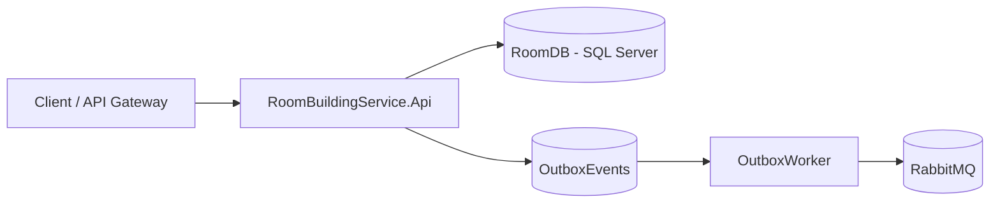

# Room & Building Service

## Muc tieu
Service nhom 1 quan ly toa nha, phong o, loai phong, giuong, thiet bi trong he thong KTX. Service nay tap trung vao quan ly tai san va trang thai phong, khong xu ly hop dong hay thu phi.

## Pham vi chuc nang
- CRUD toa nha, phong, loai phong, giuong, thiet bi
- Quan ly trang thai phong (AVAILABLE, FULL, UNDER_MAINTENANCE, INACTIVE)
- So do phong theo tang (endpoint floormap)
- Outbox + RabbitMQ: publish event `room.status.changed` khi doi trang thai phong

## Kien truc tong quan


## Cong nghe
- ASP.NET Core Web API (net9.0)
- Entity Framework Core (SQL Server)
- RabbitMQ (outbox publisher)
- Swagger UI
- Docker Compose

## Cau truc thu muc
- src/RoomBuildingService.Api: Web API, Controllers, DTOs
- src/RoomBuildingService.Core: Entities, Interfaces, Exceptions
- src/RoomBuildingService.Infrastructure: EF Core, Repositories, Messaging, Outbox
- docker-compose.yml: API + SQL Server + RabbitMQ

## Huong dan chay local
1) Cau hinh connection string trong `appsettings.json`
2) Chay lenh:
```
dotnet run --project src/RoomBuildingService.Api
```
3) Mo Swagger:
- http://localhost:5285/swagger

## Huong dan chay bang Docker
```
docker compose up --build
```
Swagger:
- http://localhost:5001/swagger

## Endpoints chinh
### Buildings
- GET /api/buildings
- GET /api/buildings/{id}
- POST /api/buildings
- PUT /api/buildings/{id}
- DELETE /api/buildings/{id}

### RoomTypes
- GET /api/roomtypes
- GET /api/roomtypes/{id}
- POST /api/roomtypes
- PUT /api/roomtypes/{id}
- DELETE /api/roomtypes/{id}

### Rooms
- GET /api/rooms?buildingId=&floor=&status=
- GET /api/rooms/{id}
- GET /api/rooms/floormap?buildingId=&floor=
- POST /api/rooms
- PUT /api/rooms/{id}
- PATCH /api/rooms/{id}/status
- DELETE /api/rooms/{id}

### Beds
- GET /api/beds?roomId=
- GET /api/beds/{id}
- POST /api/beds
- PUT /api/beds/{id}
- PATCH /api/beds/{id}/status
- DELETE /api/beds/{id}

### Equipments
- GET /api/equipments?roomId=
- GET /api/equipments/{id}
- POST /api/equipments
- PUT /api/equipments/{id}
- PATCH /api/equipments/{id}/status
- DELETE /api/equipments/{id}

## Migration
- Tu dong migrate khi start app (Program.cs)
- Tao migration moi:
```
dotnet ef migrations add <TenMigration> --project src/RoomBuildingService.Infrastructure --startup-project src/RoomBuildingService.Api
```

## Outbox Event
### Khi nao phat event
- Khi doi trang thai phong qua `PATCH /api/rooms/{id}/status`

### Event type
- `room.status.changed`

### Payload mau
```json
{
	"roomId": "<guid>",
	"oldStatus": "AVAILABLE",
	"newStatus": "FULL",
	"maintenanceReason": null,
	"changedAt": "2026-05-14T00:00:00Z"
}
```

## Luu y
- Log EF da giam ve Warning de tranh spam
- Khi dung Docker, API cho doi SQL Server san sang nho healthcheck
